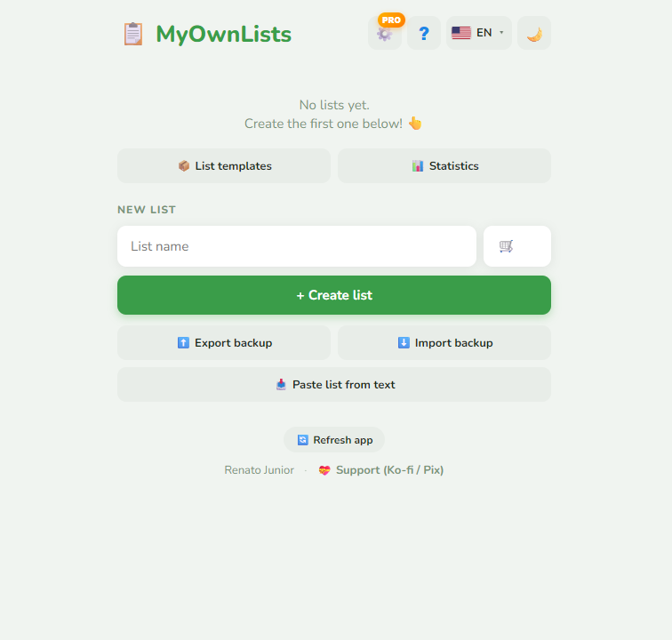
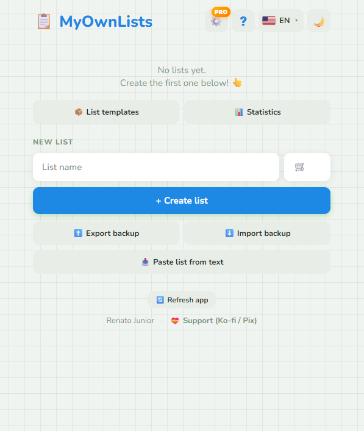
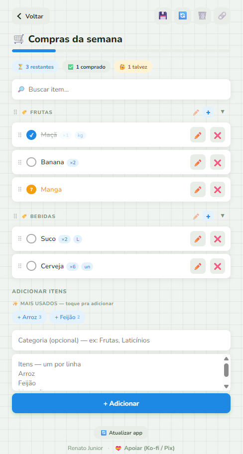
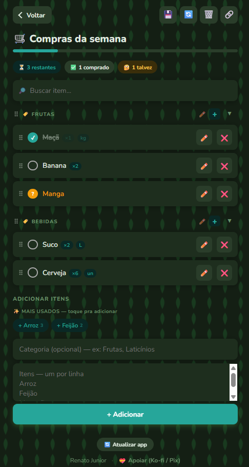

<div align="center">
  

  <h1>MyOwnLists</h1>

  <p><strong>Listas pessoais no seu navegador. Sem login. Sem ads. Sem servidor.</strong></p>

  <p>
    <a href="https://myownlists.app">🌐 <strong>myownlists.app</strong></a>
  </p>

  <p>
    
    
    
    
    
  </p>

  <p>
    <a href="#-recursos">Recursos</a> ·
    <a href="#-casos-de-uso-no-mercado">Casos de uso</a> ·
    <a href="#-pro">PRO</a> ·
    <a href="#-tecnologia">Tecnologia</a> ·
    <a href="https://ko-fi.com/renatodjunior">💝 Apoiar</a>
  </p>
</div>

---

## 🛒 O que é

App de listas — feito originalmente pra **compras de mercado** sem ter que pagar, ver anúncio ou criar conta. Cresceu pra cobrir qualquer tipo de lista pessoal que você queira manter no aparelho, sem mandar pra nuvem de ninguém.

**Filosofia:**

- 🚫 **Zero ads** — nem banner, nem patrocinado, nem flyer
- 🚫 **Zero login** — não pede email, telefone, conta social
- 🚫 **Zero servidor** — nada do que você digita sai do seu dispositivo
- 🚫 **Zero rastreio** — sem analytics, sem cookies de tracking
- ✅ **Funciona offline** após o primeiro acesso
- ✅ **Backup é seu** — exporta `.json`, guarda onde quiser

---

## ✨ Recursos

### Grátis (todo mundo)

| | Recurso | Como usa |
|---|---|---|
| 📋 | **Múltiplas listas** | Cada lista tem nome + emoji personalizado |
| 🏷️ | **Categorias com emoji** | `🍎 Frutas`, `🥩 Carnes`, `🥛 Laticínios` |
| ⚪✅🤔 | **3 estados por item** | Pendente, comprado, talvez |
| 🔢 | **Quantidade + unidade + preço** | `Maçã ×2 kg — R$ 12,50` |
| 💰 | **Total da lista** | Soma automática se tiver preços |
| ↕️ | **Arrastar e soltar** | Reordena itens e categorias |
| 🔎 | **Busca dentro da lista** | Filtro instantâneo |
| ↩️ | **Desfazer apagar** | Toast com botão "Desfazer" |
| ✨ | **Mais usados** | Sugere itens repetidos entre listas — 1 toque pra adicionar |
| 📥 | **Importar de texto** | Cola lista do WhatsApp/notas/receita → vira lista estruturada |
| 📤 | **Web Share Target** | Compartilha texto de qualquer app pra MyOwnLists (PWA instalado) |
| 🔗 | **Compartilhar 4 modos** | Lista simples / com marcações / sem marcações / imprimir-PDF |
| 🖨️ | **Imprimir / PDF** | Layout limpo pra geladeira |
| 🎤 | **Voz** (mobile) | Fala "arroz, feijão, óleo, sal" → vira lista |
| 🌙 | **Modo escuro** | Toggle 1 clique |
| 🌐 | **6 idiomas** | PT, EN, ES, 日本語, עברית, 한국어 |
| 📱 | **PWA instalável** | Vira app no celular/desktop |
| 💾 | **Backup `.json`** | Exporta/importa tudo |

### PRO — desbloqueado por doação ([💝 apoiar](https://ko-fi.com/renatodjunior))

| | Recurso | O que faz |
|---|---|---|
| 📦 | **Modelos de lista** | Salve a "lista da semana" e crie de novo em 1 toque |
| 📊 | **Painel de estatísticas** | Total de listas, % conclusão, top 8 itens mais repetidos |
| 🎨 | **Cor de destaque custom** | 6 paletas — claro e escuro |
| 🌸 | **Padrões de fundo** | Pontos / grade / patinhas / estrelas / corações / folhas |
| 📲 | **QR code** | Outro celular escaneia → lista importa direto |

---

## 🛒 Casos de uso no mercado

### 🥗 Lista da semana

```
🛒 Mercado da semana

🏷️ 🍎 Frutas
⚪ ×1 kg Maçã  (R$ 12,90)
⚪ ×6 un Banana  (R$ 5,00)
⚪ ×2 un Mamão

🏷️ 🥩 Açougue
⚪ ×500 g Patinho moído  (R$ 24,00)
⚪ ×6 un Coxa de frango

🏷️ 🥛 Laticínios
⚪ ×1 L Leite integral  (R$ 6,90)
⚪ ×1 un Manteiga

💰 Total: R$ 48,80
```

→ Clica em "📦 Salvar como modelo" → semana que vem refaz lista nova com 1 toque.

### 🔥 Churrasco do fim de semana

```
🔥 Churrasco sábado

🏷️ 🥩 Carnes
⚪ ×2 kg Picanha
⚪ ×1 kg Linguiça

🏷️ 🍺 Bebidas
⚪ ×24 un Cerveja
⚪ ×1 un Refrigerante 2L

🏷️ 🧂 Acompanhamentos
⚪ ×1 un Pão de alho
⚪ ×500 g Carvão
⚪ ×1 un Sal grosso
```

→ Compartilha "Sem marcações" no grupo da família. Cada pessoa pega um pedaço da lista, marca o que comprou, manda de volta.

### 🏠 Mudança / Casa nova

Lista persistente que demora dias pra terminar. Marca aos poucos, salva como modelo pra próxima mudança.

### 👶 Lista do bebê / chegando

Categoriza por **fralda / banho / quarto / passeio**. Compartilha QR code com a família que vai dar de presente.

### 🍽️ Receita virou lista

Cola texto de uma receita do WhatsApp em "📥 Colar lista" → parser detecta `▸ Ingredientes` + `1 kg Farinha` etc → vira lista organizada.

---

## 🖼️ Capturas de tela

### Tela inicial — versão grátis

> Listas com emoji, atalhos pra modelos/stats (PRO), backup, importar texto, footer com apoio.



### Tela inicial — PRO destravado, paleta azul

> Cor de destaque personalizada (PRO). 6 paletas disponíveis em ⚙️ Configurações.



### Dentro de uma lista

> Categorias com emoji custom, itens com quantidade/unidade/preço, pílulas de status, busca, painel "Mais usados" sugerindo itens repetidos entre listas, total da lista.



### Modo escuro + plano de fundo PRO (folhas)

> Dark mode + padrão de fundo PRO (`🌸 Folhas`). Combina com qualquer paleta de cor.



---

## 💾 Onde os dados ficam

Tudo em `localStorage` do seu navegador. **Nada vai pra servidor.**

> Os dados ficam **só no seu dispositivo e navegador atual**.
> Trocar de navegador, usar aba anônima ou limpar dados do site apaga as listas.

### ⚠️ Faça backup

Use **⬆️ Exportar backup** na tela inicial pra salvar `.json` antes de:

- Limpar cache do navegador
- Trocar de aparelho
- Desinstalar o app
- Reinstalar o sistema

O arquivo pode ser guardado na nuvem, email, pendrive — onde quiser. Importe depois quando precisar.

---

## 🛠️ Como usar

1. Acessa **[myownlists.app](https://myownlists.app)**
2. Escolhe idioma + tema
3. Cria primeira lista (nome + emoji)
4. Abre lista, adiciona itens (digita ou cola texto ou usa voz no celular)
5. Marca itens conforme compra
6. Usa **?** no header se travar em algo
7. **Exporta backup** de vez em quando

---

## 💎 PRO

App é **grátis e sempre vai ser**. PRO existe pra dar bônus pra quem decidir apoiar o projeto.

### Como destravar

⚙️ **Configurações** → **💝 Apoiar + destravar PRO**

Duas opções de apoio:

- **Ko-fi** — [ko-fi.com/renatodjunior](https://ko-fi.com/renatodjunior) (cartão internacional)
- **Pix** — QR code Pix gerado direto no app

Após (ou antes de) doar, clica em **"Destravar PRO"** — sem chave, sem login, sem fricção. Honor system.

> Se não puder ou não quiser doar, destravar mesmo assim também tá ok. App é grátis pra todo mundo.

---

## 🌐 Idiomas

| Idioma | Bandeira | Código |
|---|---|---|
| Português (BR) | 🇧🇷 | `pt` |
| English | 🇺🇸 | `en` |
| Español | 🇪🇸 | `es` |
| 日本語 | 🇯🇵 | `ja` |
| עברית | 🇮🇱 | `he` |
| 한국어 | 🇰🇷 | `ko` |

Cada idioma renderiza bandeira **SVG inline** — funciona igual em qualquer SO (Windows desktop também).

---

## 📦 Tecnologia

100% frontend, sem framework, sem build step, sem backend.

| Stack | Detalhe |
|---|---|
| HTML/CSS/JS puro | Vanilla, single file |
| LocalStorage | Único storage |
| Service Worker | PWA + offline |
| SortableJS | Drag-and-drop |
| qrcode-generator | QR codes (PRO + Pix) |
| Web Speech API | Voz (mobile) |
| Web Share Target API | Receber texto de outros apps |

**Tamanho total:** ~80KB sem comprimir, ~25KB gzip. Carrega em <1s em 4G.

**Hospedagem:** GitHub Pages. Domínio próprio com HTTPS.

---

## 🤝 Contribuir

Issues e PRs bem-vindos no [GitHub](https://github.com/renatodjunior/myownlists). Foco em manter:

- Single-file simplicity
- Zero dependências runtime obrigatórias
- Filosofia "no login, no ads, no server"
- Compatibilidade com 6 idiomas existentes

---

## 👤 Autor

Feito por **[@renatodjunior](https://github.com/renatodjunior)** porque queria fazer compras de mercado sem precisar pagar, ver ad ou criar conta em outro app.

Se ajudou, considera mandar um cafézinho:

<p>
  <a href="https://ko-fi.com/renatodjunior"></a>
  
</p>

---

<div align="center">
  <em>MyOwnLists — suas listas, no seu navegador.</em>
</div>
